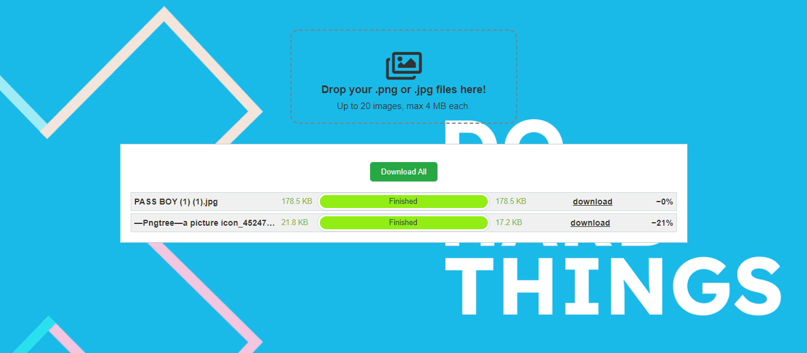

# ALX Image Compression Project Documentation

## Table of Contents

1. [Project Overview](#project-overview)
2. [Technologies Used](#technologies-used)
3. [Installation and Setup](#installation-and-setup)
4. [Usage](#usage)
5. [Code Explanation](#code-explanation)
    - [index.html](#indexhtml)
    - [main.js](#mainjs)
    - [Counter.js](#counterjs)
    - [main.css](#maincss)
    - [compress_files.js](#compress_filesjs)
6. [Authors](#authors)

## Project Overview

The ALX Image Compression Project is a web application that allows users to upload PNG or JPEG images for compression. The project utilizes a serverless function approach, deployed via Netlify, to perform the image compression using the `imagemin` library.

## Technologies Used

- HTML, CSS, and JavaScript for the front-end
- Node.js for the serverless function
- `imagemin`, `imagemin-jpeg-recompress`, and `imagemin-pngquant` for image compression
- Netlify for deployment and serverless function execution

## Screenshot




## Installation and Setup

1. Clone the repository:
   ```sh
   git clone <repository-url>
   ```
2. Navigate to the project directory:
   ```sh
   cd alx-image_compression_project
   ```
3. Install the dependencies:
   ```sh
   npm install
   ```
4. Deploy the project on Netlify or any other serverless platform that supports Node.js.

## Usage

1. Open the application in a web browser.
2. Drag and drop PNG or JPEG images into the designated area.
3. The application will display the original file size and upload progress.
4. Once the compression is complete, the new file size and a download link will be provided.

## Code Explanation

### index.html

This is the main HTML file for the project. It sets up the basic structure of the web page, including a drop area for images and a section to display the results.


### main.js

This JavaScript file handles the drag-and-drop functionality, file uploading, and displaying the results. It imports a `Counter` class from `Counter.js` to manage unique IDs for each file.


### Counter.js

This file defines a simple `Counter` class used to generate unique IDs for each file.


### main.css

This CSS file contains styles for the web page, including the drop area, results section, and progress bars.


### compress_files.js

This is a serverless function that handles the image compression using `imagemin`, `imagemin-jpeg-recompress`, and `imagemin-pngquant`.


### .gitignore

This file specifies the files and directories that should be ignored by Git.


### netlify.toml

This is the configuration file for Netlify, specifying the build and function directories.


### package.json

This file contains the metadata and dependencies for the project.


## Authors

- Anthony Sackey
- Calvin Sewornu
